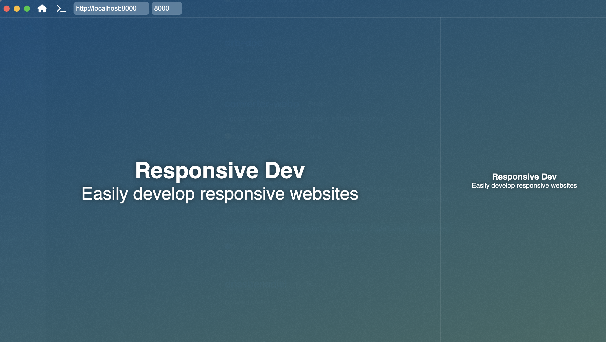

<a href="https://github.com/drissbenadjal"></a>

## AdaptiView App

Easily develop responsive websites.

You can download the project :

```bash

git clone --depth 1 --branch main https://github.com/drissbenadjal/AdaptiViewApp.git AdaptiViewApp
cd AdaptiViewApp
npm install
```

## Starting Development

Start the app in the `dev` environment:

```bash
npm run dev
```

## Maintainers

- [Driss Benadjal](https://github.com/drissbenadjal)
